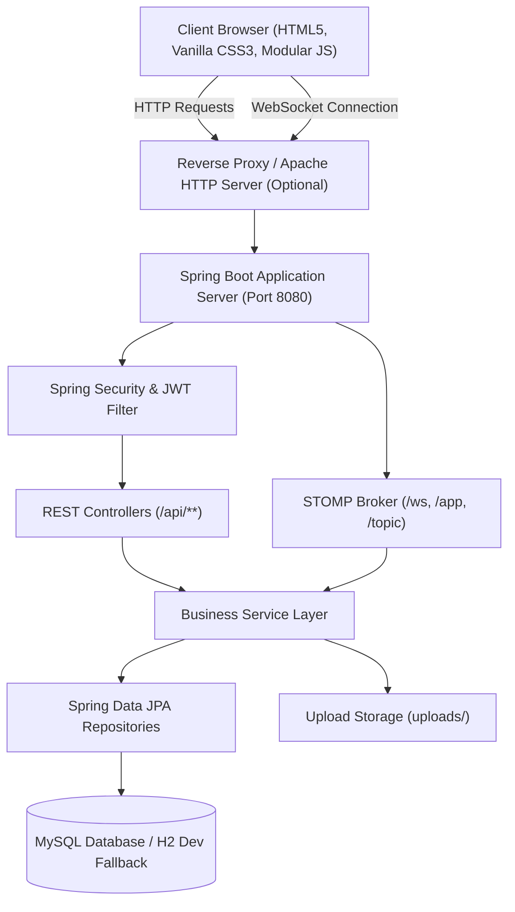

# Let's Talk (ConnectChat) — System Architecture Documentation

## 1. System Overview
Let's Talk is a full-stack real-time communication platform designed with a clean single-root architecture. The application integrates relational persistence, Spring Security with stateless JSON Web Tokens (JWT), bidirectional WebSocket messaging via STOMP/SockJS, WebRTC audio/video peer connections, and a modular HTML5/CSS3/Vanilla JavaScript frontend served directly from Spring Boot.



---

## 2. Component Responsibilities

### Frontend Layer (`src/main/resources/static/`)
- **HTML5 (`index.html`)**: Semantic structure providing authentication, chat dashboard, contact search, group creator, 24h stories tray, and calling overlay HUD.
- **CSS3 (`css/`)**: 10 modular stylesheets (`base.css`, `layout.css`, `components.css`, `auth.css`, `chat.css`, `modal.css`, `stories.css`, `calls.css`, `responsive.css`, `theme.css`) with light, dark, royal, and purple themes.
- **Vanilla JavaScript (`js/`)**: Decoupled modules with zero third-party UI frameworks:
  - `api.js`: Centralized REST client with relative URLs and automatic token attachment.
  - `auth.js`: Registration, login, logout, and session lifecycle.
  - `websocket.js`: STOMP client over SockJS with automatic reconnect and topic subscriptions.
  - `chat.js`: Active conversation management, message rendering, reply quoting, deletion context menus.
  - `messages.js`: Text & media sending, voice notes via `MediaRecorder`, status ticks (`SENT`, `DELIVERED`, `READ`).
  - `connections.js`: User discovery, connection requests, accept/reject workflows.
  - `groups.js`: Group creation, participant checklist, group chat routing.
  - `stories.js`: 24-hour ephemeral stories, image/video upload, full-screen viewer with progress bars.
  - `calls.js`: Real one-to-one WebRTC audio and video calling with STUN servers and local/remote stream rendering.
  - `files.js`: File selection, MIME validation, drag-and-drop, category routing.
  - `profile.js`: Profile editing and avatar photo upload.
  - `emoji.js`: Lightweight UTF-8 emoji picker with category tabs.
  - `theme.js`: Real-time theme switcher persisted in `localStorage`.
  - `notifications.js`: In-app toasts, unread badge counters, and real-time alerts.
  - `utils.js`: Date formatting, initials generation, avatar gradients, and HTML sanitization.
  - `app.js`: Main lifecycle orchestrator, event binding, and auto-session validation.

### Backend Layer (`src/main/java/com/connectchat/`)
- **Security (`security/`)**:
  - `JwtService`: Signs and validates HMAC-SHA256 tokens with userId and username claims.
  - `JwtAuthenticationFilter`: Extracts Bearer tokens, populates `SecurityContextHolder`.
  - `SecurityConfig`: Configures BCrypt password encoder, stateless session creation, public vs protected routes.
- **Controllers (`controller/`)**: Expose clean RESTful APIs with proper HTTP status codes.
- **WebSocket Broker (`websocket/`)**:
  - `WebSocketConfig`: Registers `/ws` endpoint with SockJS, sets `/app` prefix and `/topic` broker. Intercepts CONNECT frames to authenticate users via JWT headers.
  - `WebSocketMessageController`: Handles incoming STOMP actions (`/app/chat.send`, `/app/chat.status`, `/app/chat.typing`, `/app/call.signal`).
  - `WebSocketEventListener`: Detects connection and disconnection events to track online presence and broadcast status updates.
- **Services (`service/`)**: Core business logic, transaction management (`@Transactional`), and event dispatching.
- **Repositories (`repository/`)**: Spring Data JPA interfaces with optimized queries and indexes.
- **Entities (`entity/`)**: Relational models mapping directly to `database/schema.sql`.

---

## 3. Core Workflow Sequence Flows

### A. Authentication Flow
1. User submits login or registration form.
2. `AuthController` invokes `AuthService`.
3. Passwords are hashed / verified using BCrypt.
4. On success, `JwtService` creates a signed token containing user identity claims.
5. The client stores the token in `localStorage` and initializes the WebSocket STOMP handshake with `Authorization: Bearer <token>` in the CONNECT headers.

### B. Message Delivery & Double Ticks Flow
```mermaid
sequenceDiagram
    autonumber
    actor Alice as Alice (Sender)
    participant WS as WebSocket Broker
    participant MS as MessageService
    participant DB as Relational Database
    actor Bob as Bob (Receiver)

    Alice->>WS: SEND /app/chat.send {conversationId, content, type}
    WS->>MS: Validate authentication & conversation membership
    MS->>DB: Save Message (status: SENT)
    MS->>WS: Broadcast to /topic/conversation/{id}
    WS-->>Alice: Render message with single tick (✓ SENT)
    WS-->>Bob: Receive message; Send status DELIVERED
    Bob->>WS: SEND /app/chat.status {messageId, status: DELIVERED}
    WS->>MS: Update Message in DB
    WS->>Alice: Broadcast status update (✓✓ DELIVERED)
    Bob->>Bob: Opens / views conversation
    Bob->>WS: SEND /app/chat.status {messageId, status: READ}
    WS->>MS: Update Message in DB
    WS->>Alice: Broadcast status update (✓✓ Blue READ)
```

### C. File & Media Transfer Flow
1. User clicks attachment or selects image, video, document, or records voice note.
2. File is validated on the client (type & <=50MB).
3. Client posts `multipart/form-data` to `/api/files/upload?category=<category>`.
4. `FileService` verifies file extension, checks against directory traversal (`..`), generates a UUID filename, and persists into `uploads/<category>/<uuid>.<ext>`.
5. `FileController` returns JSON with relative `fileUrl`.
6. Client dispatches message referencing `mediaUrl` through WebSocket, creating both a `Message` record and an `Attachment` record.

### D. WebRTC Audio & Video Calling Flow
```mermaid
sequenceDiagram
    autonumber
    actor Alice as Alice (Caller)
    participant WS as WebSocket STOMP
    participant CS as CallService
    actor Bob as Bob (Callee)

    Alice->>Alice: Access camera/mic & create RTCPeerConnection
    Alice->>WS: SEND /app/call.signal (CALL_OFFER, offer SDP)
    WS->>CS: initiateCall(caller, receiver, type)
    WS->>Bob: Relay to /topic/user/{bobId}/call
    Bob-->>Bob: Ringing HUD displays with Accept/Reject
    Bob->>Bob: User clicks Accept; Access media & setRemoteDescription
    Bob->>WS: SEND /app/call.signal (CALL_ANSWER, answer SDP)
    WS->>CS: updateCallStatus(callId, ACCEPTED)
    WS->>Alice: Relay answer SDP to /topic/user/{aliceId}/call
    Alice->>Alice: setRemoteDescription
    Alice->>WS: SEND /app/call.signal (ICE_CANDIDATE)
    WS->>Bob: Relay candidate
    Note over Alice,Bob: Direct P2P Audio/Video Media Stream Established via WebRTC
    Alice->>WS: SEND /app/call.signal (CALL_ENDED)
    WS->>CS: updateCallStatus(callId, ENDED, duration)
    WS->>Bob: Relay call termination & tear down peer connection
```

---

## 4. Deployment Architecture
- **Production Model B (Recommended)**: Spring Boot serves all static HTML/CSS/JS resources directly from `src/main/resources/static/`, and Apache HTTP Server acts as an SSL/TLS terminator and reverse proxy for all `/`, `/api`, and `/ws` connections.
- **Production Model A**: Apache HTTP Server serves static files directly from document root and reverse proxies `/api` and `/ws` to Spring Boot on port 8080.
